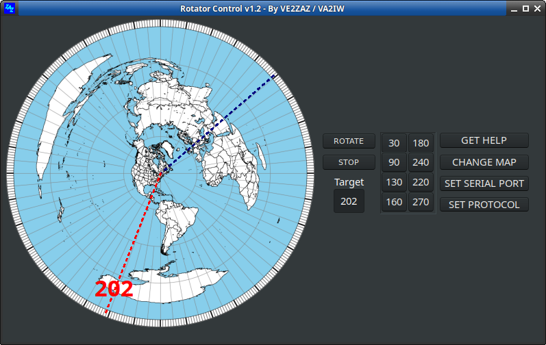

# Antenna Rotator "Rotor" Control Software
A simple, efficient way to remote-control antenna rotator control boxes using the Rotor-EZ, DCU-1+ (RT-21), Yaesu GS-232A or DCU-1 protocols.

By Bertrand Zauhar, VE2ZAZ / VA2IW   
https://ve2zaz.net   
https://github.com/VE2ZAZ   
https://www.qrz.com/db/VE2ZAZ   

### Overview
This Antenna Rotator Control Software offers a simple, practical way of remote operating antenna rotator (aka “rotor”) control boxes compatible with the Rotor-EZ, Green Heron (RT-21), Yaesu GS-232A and DCU-1 protocols. This software works well with VE2ZAZ Smart Rotator Controller, which was designed as an add-on to HyGain Tailtwister, Ham-III and Ham-IV controller boxes. The software’s main features are:
- It offers a PC interface to the VE2ZAZ Smart Rotator Controller,
- It can also control any antenna rotator control box compatible with the Rotor-EZ, Green Heron (RT-21), Yaesu GS-232A and DCU-1 protocols (the latter two are implemented but have not been tested). The control protocol is selectable with a pull-down menu. 
- It offers a re-sizeable window to accommodate various screen needs,
- It displays the current heading on a station-centered azimuthal map (except in DCU-1 mode),
- The azimuthal map is mouse-clickable to quickly pick a target heading,
- The Azimuthal map can be customized for the station location,
- The window offers 8 memory buttons for frequently used headings,
- It has a Stop button to interrupt the ongoing rotation,
- The program can receive N1MM+ logger “Rotate” and “Stop Rotate” commands via UDP socket,
- User settings such as window size and location, serial port, protocol and azimuthal map file name are saved at program exit, and restored at program launch. The settings file resides in the same directory as the program directory. 
- A help button invokes the help file, a PDF formatted document. 
- Software executables are available for Ubuntu-Linux and Windows 10. The software may be compiled for other OS releases, such as MacOS using the Lazarus IDE (Free Pascal) suite, however it has not been tested by the author.

For more details on operation, configuration and licensing of this software, please refer to the [help.pdf](./help/help.pdf) file.
